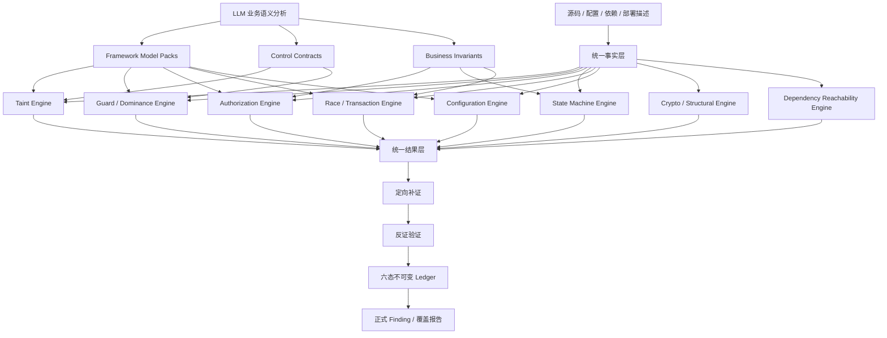

# SecVal 安全分析内核架构重构

状态：目标架构，尚未完整实现。  
记录日期：2026-09-09。  
实施进度见 [安全分析内核重构看板](security-analysis-kernel-roadmap.md)。

## 1. 目标与边界

本次是安全分析内核的架构重构，不是继续为 SinkSpring 补充关键词。SinkSpring 只作回归集，不得作为新规则的唯一设计依据。

目标是将系统拆成四个职责清晰的层：

1. **统一事实层**：只保存源码、配置和部署中可复核的客观关系。
2. **专用分析器**：用不同算法分析数据流、控制缺失、授权、状态机、竞态、配置、结构与依赖问题。
3. **语义层**：提供框架 API、安全控制和业务不变量的可版本化语义。
4. **统一结果层**：补证、反证、去重、裁决并生成可追溯报告。

不追求用一种 Source→Sink 模型解释全部漏洞。数据流、授权、业务状态和配置关系使用不同分析器，共享同一事实层和结果层。

## 2. 总体架构



处理原则：**工具证明代码事实，专用分析器执行安全规则，LLM 解释业务语义，Ledger 保存最终裁决。**

## 3. 统一事实层

统一事实层是所有分析器共享的代码与系统关系库。它不判断漏洞，只回答“代码中客观存在什么”。

### 3.1 用处

- 避免每个分析器重复解析源码和建图。
- 避免 Agent 在不同证据包中对同一调用关系作出不同推断。
- 使 SQL 注入、IDOR 和竞态分析可共享同一路由、调用链和资源事实。
- 每个结论都能回到固定快照、文件、行号、节点和边。
- 记录解析失败、外部依赖缺失、动态分派和反射等盲区，不将“未找到”当成“不存在”。

### 3.2 事实种类

| 事实 | 主要内容 | 建议来源 |
|---|---|---|
| AST | 类、方法、参数、字段、注解、调用、条件、返回和字面量 | Tree-sitter / Joern frontend |
| CFG | 分支、循环、异常、基本块及可达性 | Joern CPG |
| DDG | 定义-使用、参数、返回值、字段和容器元素传播 | Joern CPG + 扩展摘要 |
| Call graph | 调用者、目标、参数映射、接口实现、动态分派 | Joern + 现有 Neo4j 关系 |
| Entry graph | HTTP、GraphQL、RPC、MQ、Job、CLI、WebSocket 入口 | Framework Model Pack |
| Config graph | profile、默认值、环境覆盖、消费组件和部署资源 | 格式解析器 + 资源适配器 |
| Dependency graph | 直接/间接依赖、版本、实际调用和 CVE | lockfile/SBOM + call graph |
| Domain facts | Principal、Resource、Owner、Tenant、Role、State、Amount | 确定性抽取 + 语义标注 |

## 4. 专用分析器

### 4.1 Taint Engine

回答“不可信数据或敏感数据是否到达危险效果”。从 Source 正向传播，同时从已知或未知 Effect 反向切片，以 CPG 节点 ID 求交并连接完整路径。传播覆盖实参到形参、返回值、字段读写、getter/setter、容器元素、alias 和已建模异步边界。

实现方式：Framework Model Pack 标注 Source；Effect Registry 按完整类型、方法签名、参数位置和能力标注 Effect；Joern 执行跨过程 DDG 查询，外部依赖由调用摘要补边；使用 sql、shell、path、url、html、secret、resource_identity 等 taint kind 防止语义混流；flow state 记录 normalized、root_bounded、encoded、parameterized 等状态。

输出结构化 Source、路径节点、Effect、参数位置、taint kind、flow state 和盲区。适用于注入、路径遍历、SSRF、XSS、反序列化和敏感数据泄露。反射、native、动态代码和缺失依赖不能静默断链。

### 4.2 Guard / Dominance Engine

回答“安全检查是否真正保护敏感操作的所有执行路径”。使用 CFG 支配关系和 def-use 关系验证 Guard 是否位于 Effect 前、是否检查同一个值、失败分支是否终止，以及是否存在绕过路径。

实现方式：计算 dominator 和 post-dominator；把条件操作数连接到受保护数据；由 Control Contract 声明 validator/sanitizer 适用的 taint kind、接受条件和失败语义。输出 dominates、same_value、failure_terminates、covered_paths 和 bypass_paths。适用于认证授权缺失、fail-open、分支漏检和无效 sanitizer。

### 4.3 Authorization Engine

回答“哪个 Principal 是否有权对哪个 Resource 执行某种 Operation”。构建 Principal—Resource—Owner/Tenant—Operation—Guard 关系，区分可信认证上下文与客户端可控 Header/参数，搜索主体归属、租户、角色或 permission 约束，再由 Guard Engine 验证约束是否支配资源操作。

实现方式：从路由、安全上下文、实体类、Repository/ORM 调用和条件表达式抽取关系；Framework Model Pack 提供框架和自研权限 API 语义。输出主体信任等级、资源类型、操作、已证明约束、缺失关系和绕过路径。适用于 IDOR、租户逃逸、功能授权缺失和角色提升。

### 4.4 State Machine Engine

回答“业务实体是否能进入不允许的状态转换”。识别状态字段、状态读取、前置条件、外部副作用和状态写入，形成 from-state → operation → to-state，再与 Business Invariant 比较。

实现方式：从 enum、字段赋值、switch/if、ORM 写入、测试和显式规则提取转换。LLM 可以提出不变量，但未经代码、文档、测试或人工确认时只能标为 PROPOSED。输出实体、操作、前置状态、目标状态、缺失条件和副作用。适用于重复退款、优惠券复用、越级跳转、审批绕过和密码重置流程问题。

### 4.5 Race / Transaction Engine

回答“业务检查和写入之间是否可能被并发请求破坏”。抽取同一资源的 READ → CHECK → WRITE，检查事务、隔离级别、行锁、版本字段、唯一约束、原子更新和幂等键。

实现方式：联合 CFG、ORM 模型、SQL、事务注解、数据库约束和部署数据库语义。无法确定运行时隔离级别时保留前提，不直接确认。适用于库存超卖、余额超扣、重复支付、TOCTOU 和幂等失效。

### 4.6 Configuration Engine

回答“最终生效的配置与资源组合是否产生危险系统属性”。将 YAML、Properties、JSON、XML、TOML、env、Docker、Kubernetes、Terraform 解析成统一配置资源图，解析 base、profile、环境变量、命令行和部署覆盖，再查询“启用 + 暴露 + 缺少控制”等组合属性。

实现方式：格式解析器产生 ConfigNode；框架适配器建立 CONFIGURES、OVERRIDES、EXPOSES、PROTECTS 边；策略包查询有效值和部署前提。IaC 可以接入 Checkov/Trivy，但结果必须转换为统一证据契约。输出原始值、有效值、覆盖链、消费组件、暴露资源、安全控制和部署限制。

### 4.7 Crypto / Structural Engine

回答“是否存在局部结构即可判断或进一步验证的危险模式”。使用 AST、完整签名、类型、常量传播和使用上下文检测弱算法、固定 IV、弱随机数、证书校验关闭、硬编码秘密和调试后门。结构匹配先生成候选，再验证该值是否用于安全敏感用途。

### 4.8 Dependency Reachability Engine

回答“漏洞依赖及其 API 是否实际可达”。从 manifest、lockfile 和 SBOM 解析版本与 CVE，取得漏洞符号后查询调用图，区分依赖存在、漏洞 API 被调用、外部入口可达和运行配置激活四个层级。

## 5. 语义层

### 5.1 Framework Model Packs

回答“框架 API 在安全分析中代表什么”。模型包按语言、框架和版本声明入口、Source、Effect、参数位置、返回值、propagator、认证上下文、事务、ORM、模板和序列化语义。匹配以完整类型与方法签名为主，名称模式只能作为低置信候选。

模型来源依次为官方文档、框架源码、人工维护、自动调用摘要和 LLM 提议。LLM 提议必须经过正例、反例、封装、继承、重载和版本差异测试后才能启用。项目自研框架可以提供独立扩展包，不得修改调度器代码。

### 5.2 Control Contracts

回答“某个控制究竟保证什么”。契约声明输入状态、输出状态、适用漏洞类型、接受条件和失败行为。例如 Path.normalize 只产生 normalized 状态，不产生 root_bounded；HTML text 编码不能消除 SQL、Shell 或 JavaScript context 风险；JWT decode 只表示解析，不表示验签。

契约通过实现体分析、官方文档、测试和人工批准建立。分析器必须验证控制处理的是同一个值、支配目标操作且失败会终止，不能因函数名包含 safe、validate 或 sanitize 就认为有效。

### 5.3 Business Invariants

回答“业务必须始终满足什么安全规则”。不变量描述主体、资源、状态、金额、次数、顺序和职责分离，例如退款总额不超过支付额、只有 PAID 可退款、申请人与审批人不同、主体租户等于资源租户。

不变量来源包括用户明确输入、领域文档、API 文档、测试、数据库约束、状态枚举和现有校验。LLM 只能产生 PROPOSED 不变量；经代码、文档、测试或人工确认后才可成为正式策略。

### 5.4 LLM 业务推理边界

LLM 接收真实图路径、控制流、字段定义、配置关系和固定源码片段，用于解释敏感业务操作、识别主体与资源、提出不变量、理解自研控制和分类未知外部效果。

LLM 不得创建不存在的节点、把无图连接的文件拼成路径、覆盖解析器事实、自动批准 Model Pack，或仅凭自然语言把 NEEDS_REVIEW 提升为 CONFIRMED。输出必须列出 facts_used、assumptions、counterevidence、unknowns 和 proposed_models/invariants。

## 6. 统一结果层

统一结果层把八类分析器的不同输出转换为同一种 Candidate，并负责定向补证、反证、去重、裁决、覆盖统计和报告生成。模型文字不能绕过该层成为正式 Finding。

### 6.1 Candidate Ledger

统一候选至少包含 candidate kind、rule、来源分析器、入口节点、敏感操作节点、结构化路径、控制、假设、未知项、快照和分析器版本。多个引擎发现同一问题时追加来源和证据，不重复创建正式发现。

### 6.2 定向补证

结果层根据候选类型计算明确缺口，例如缺少调用者、callee 实现、主体来源、资源归属、profile、事务隔离级别、数据库约束或 sanitizer 实现。补证任务必须指向节点、符号或配置资源，禁止让模型无边界搜索。

### 6.3 反证验证

每个候选主动检查全局认证中间件、有效 sanitizer、不可达代码、测试代码、禁用 profile、数据库约束、锁、幂等控制和安全分支。支持证据与反证使用相同的快照和证据强度标准。

### 6.4 结构化去重

Finding 身份使用 rule、entry node、operation/effect node、resource、root-cause node 和 snapshot；不再依赖标题、路由自然语言和固定 Sink 词表。合并后保留全部发现来源、路径变体和代码位置。

### 6.5 六态终裁

| 状态 | 含义 |
|---|---|
| CONFIRMED | 路径、控制、入口和业务前提均有足够证据 |
| REJECTED | 候选假设或数据连接错误 |
| UNREACHABLE | 已证明没有有效入口；未找到入口不能使用此状态 |
| DEFENDED | 路径存在，但有效控制覆盖全部相关路径 |
| DUPLICATE | 与另一候选属于同一结构化根因 |
| NEEDS_REVIEW | 证据、语义或部署前提不足 |

裁决只追加不覆盖，记录状态变化、理由、证据 ID、工具与模型版本和时间。代码、依赖或控制闭包变化后，旧裁决回到 NEEDS_REVIEW。

### 6.6 报告与覆盖

正式报告是 Ledger 的确定性视图，包含入口、Source/Principal、完整路径、Effect/Operation、缺失或有效控制、影响、前提、反证、限制、源码位置和裁决历史。覆盖报告同时展示成功解析、失败解析、未知分派、缺失依赖、未解析配置和各分析器执行范围。

## 7. 工程实现方式

### 7.1 模块边界

建议新增以下顶层包，现有审计运行时通过接口调用，不直接依赖 Joern、Neo4j 或具体规则格式：

| 模块 | 职责 |
|---|---|
| facts | 节点、边、位置、快照、解析状态和查询接口 |
| frontends | Joern、Tree-sitter、配置、SBOM 结果适配 |
| semantics | Model Pack、Control Contract、Business Invariant 注册与版本 |
| analyzers | 八类专用分析器，只消费 facts/semantics 接口 |
| candidates | 统一 Candidate 契约、身份与合并 |
| adjudication | 补证、反证、六态 Ledger 和失效判断 |
| reporting | Ledger 的确定性报告、SARIF/JSON/Markdown 转换 |
| evaluation | 盲测、变体测试、覆盖与性能指标 |

依赖方向固定为：frontends → facts ← semantics；analyzers 只依赖 facts 和 semantics；adjudication 只消费 Candidate 和 evidence；reporting 不反向修改裁决。

### 7.2 渐进迁移

现有关键字路径不能一次删除。迁移期间每个候选必须标记 graph、semantic-rule、heuristic、model、external-scanner 来源，并分别统计召回和误报。旧规则降级为 bootstrap hint，不允许单独确认漏洞；当对应 CPG 查询通过盲测后再移除旧路径。

第一批只实现 Java/Spring，但事实与语义契约不得包含 Controller/Service/Repository 等固定目录要求。第二语言接入时不能修改分析器核心接口，以此检验抽象是否通用。

### 7.3 未知效果与未知语义

用户输入到达源码不可见的外部调用时生成 UNKNOWN_EFFECT；反射、动态代理、native、运行时生成代码和未解析配置均显式进入 coverage gaps。LLM 可以分类并提出新模型，但结果保持 NEEDS_REVIEW，直到依赖摘要、动态验证、测试或人工审批补足证据。

### 7.4 质量门禁

1. 所有图事实有固定快照和源码位置。
2. 所有分析器有正例、反例、重命名、封装、重载、继承和控制有效性测试。
3. SinkSpring 只允许检测回归，不允许作为规则提交的唯一测试。
4. 新语义模型至少在两个独立项目或通用框架契约上成立。
5. 每阶段必须通过未参与开发的盲测项目。
6. 召回、误报、未知率、路径证据完整率、时间和内存分别统计。
7. 未通过门禁不得以提高模型预算或添加目标项目名称绕过。

## 8. 参考设计

- CodeQL：局部/全局 data flow、taint tracking、barrier、additional flow step 和 flow state。
- Joern：跨语言 CPG、控制流/数据流以及跨过程反向切片。
- Semgrep：规则与引擎分离的 Source/Sink/Propagator/Sanitizer 模型。
- SonarQube：项目级 Source、Sink、Sanitizer、Validator、Passthrough 扩展。
- FlowDroid/Boomerang：上下文、字段、对象敏感和按需双向分析。
- Checkov：配置资源关系与图策略。
- SinkScope 架构报告：任务可靠性、候选清单、事件流和六态裁决思路；不照搬固定规则加 LLM 追踪的发现内核。

参考只提供设计启发，具体实现、许可、版本与正确性必须独立核验。

## 9. 数据契约

节点必须有稳定 ID、快照、源位置、解析器版本和置信来源；边必须声明 `CALLS`、`ARGUMENT_TO_PARAMETER`、`RETURNS_TO`、`DEFINES_USES`、`CONTROLS`、`OVERRIDES`、`CONFIGURES` 等类型。确定事实、保守候选和 LLM 推断必须分开存储。

```json
{
  "node_id": "java:method:OrderService.load(java.lang.String)",
  "kind": "method",
  "snapshot_id": "snapshot-1",
  "location": {"path": "OrderService.java", "line": 18},
  "origin": "joern",
  "confidence": "parser_proven"
}
```
